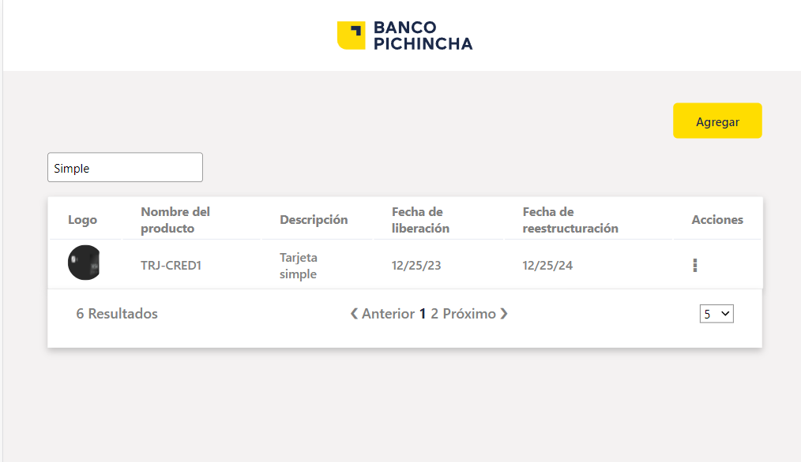

# Prueba Tecnica
Este reto esta realizado con Angular v16 y Typescript 5.1.3

## Funcionalidades requeridas

1. **F1 - Listado de productos financieros**

    

2. **F2 - Búsqueda de productos financieros**

    

3. **F3 - Cantidad de registros**

    

4. **F4 - Agregar producto**

    

## Funcionalidades opcionales

1. **F5 - Editar producto**

    

2. **F6 - Eliminar producto**

    
    

## Ejecución del proyecto

Ejecutar `npm i` y luego `ng serve`. Navegar a `http://localhost:4200/`. 

## Ejecutar test unitarios

Ejecutar `ng test --code-coverage` para ejecutar los test unitarios. 

1. **Coverage**

    

2. **Coverage HTML**

    Cuando se ejecuta el comando `ng test --code-coverage` se genera una carpeta coverage en el proyecto. Ingresar a la carpeta y abrir mediante un live server el index.html

    

    

    
    

